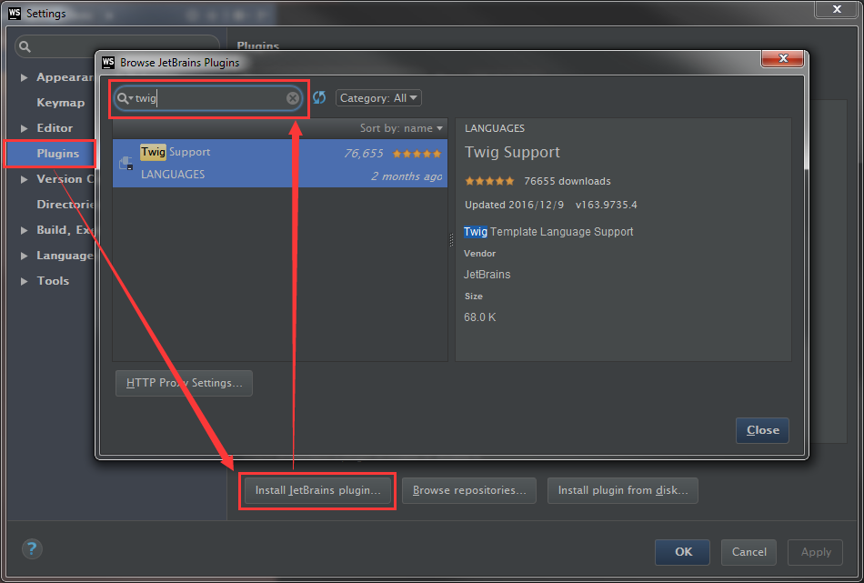
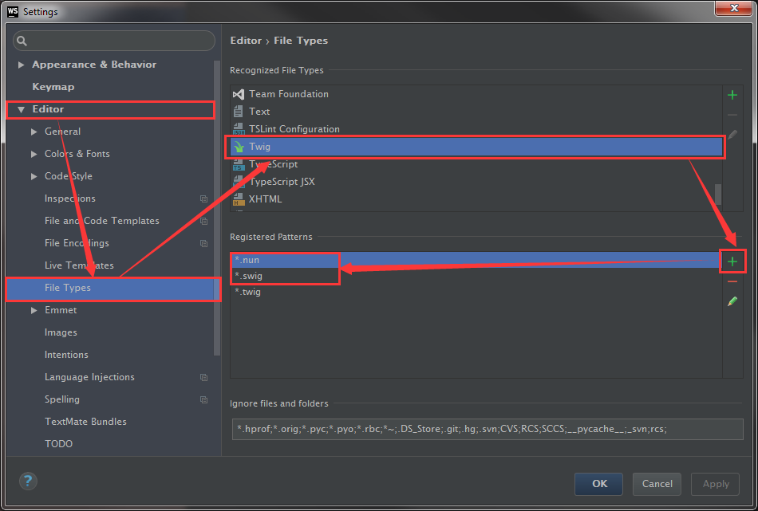

# [NexT Documentation](http://theme-next.iissnan.com/) 

这是 NexT 主题文档的源码，仅接受文档相关的问题。如果你有任何关于 NexT 主题的使用问题，请访问 [NexT 主题仓库](https://github.com/iissnan/hexo-theme-next)，谢谢。

This is the repository for **documentations** of NexT theme, it only accepts issues about documentations.
If you have any questions about using NexT, please visit [NexT repository](https://github.com/iissnan/hexo-theme-next), thanks.

----------

Welcome to contribute. Appreciate for any type of contribution。

## Development

### Requirements

1. Node.js. Download [Node.js](https://nodejs.org/en/download/)
2. Gulp Cli. Run `npm install --global gulp-cli`
3. Project Dependencies. Run `npm install`

### Running Up

After all project dependencies have been resolved, run `gulp` in the project root directory to kick off a local server. 
This server (using BrowserSync) will listen on port `3000`, visit `http://localhost:3000` to see the documentations.

### Project Structure

TBD

### Syntax Highlight Support of WebStorm for Nunjucks Template

To make WebStorm to recognize Nunjucks templates, follow the following steps:

1. Install `Twig` Plugin from JetBrains Plugin Repository.

    
    
2. Add Nunjucks template extension to the `Twig` file type.

    
    
    In this repo, `.nun` extension is used for Nunjucks Template, so add it to the `Registered Pattern`.
